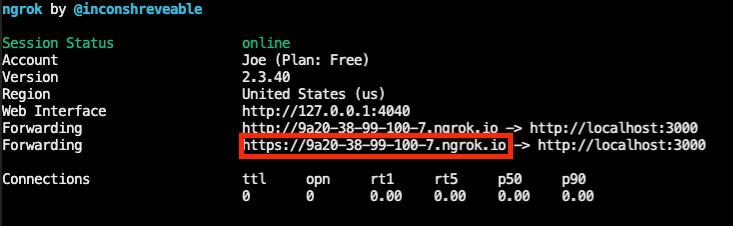

# Zoom Chatbot Powered by Claude (Anthropic.ai)

This project integrates Anthropic's Claude AI with Zoom Team Chat, creating an intelligent chatbot that can assist users directly within their Zoom conversations. The bot leverages Claude's advanced language understanding and generation capabilities to provide helpful responses to user queries on a wide range of topics.

# What the Chatbot does?

- Responds to user messages in Zoom Team Chat using Anthropic's Claude AI.
- Maintains conversation history for context-aware responses.
- Can be used in direct messages or invoked in group chats and channels.
- Provides helpful information, answers questions, assists with tasks, and engages in discussions on various topics.

## Prerequisites

Before you can use this chatbot, you'll need the following:

- Node.js (version 12 or later)
- A Zoom account 
- An Anthropic AI account

## Setup

- First, clone the repository:

- git clone [https://github.com/ojusave/Zoom-Anthropic-Chatbot.git](https://github.com/zoom/team-chat-app-anthropic-ai)

- cd Zoom-Anthropic-Chatbot

- Next, install the required Node.js packages:

```
 npm install
```

## Configuration

You need to set up your environment variables. Create a `.env` file in the project root and add the following variables:

```
touch .env
```

```
ZOOM_CLIENT_ID=
ZOOM_CLIENT_SECRET=
ZOOM_BOT_JID=
ZOOM_WEBHOOK_SECRET_TOKEN=
ANTHROPIC_API_KEY=
```


To obtain these variables:

- For Zoom variables (ZOOM_CLIENT_ID, ZOOM_CLIENT_SECRET, ZOOM_BOT_JID, ZOOM_WEBHOOK_SECRET_TOKEN, ZOOM_VERIFICATION_CODE), refer to the [Zoom App Marketplace guide on creating a Team Chat app](https://developers.zoom.us/docs/team-chat-apps/create/).

- For the ANTHROPIC_API_KEY, you can obtain it by applying for access to Claude via the Anthropics [web console](https://console.anthropic.com/docs/api). Once you have access, you can generate API keys in your Account Settings.

### Start your Ngrok (reverse proxy)

Use Ngrok to tunnel traffic to this application via https. Once installed you may run this command from your terminal:

```bash
ngrok http 4000
```

Ngrok will output the origin it has created for your tunnel, eg `https://9a20-38-99-100-7.ngrok.io`. You'll need to use this across your App configuration in the Zoom Marketplace (web) build flow (see below).

Please copy the https origin from the Ngrok terminal output and paste it in the `PUBLIC_URL` value in the `.env` file.


Please note that this ngrok URL will change once you restart ngrok (unless you purchased your own ngrok pro account). If you shut down your Ngrok (there's no harm to leaving it on), upon restart you'll need to copy and paste the new origin into the `.env` file AND also to your Marketplace build flow.

## Running the Application

To start the application:
```
node index.js

```

The application will run on `http://localhost:4000/` by default, but you can set a different port by changing the `PORT` variable in your `.env` file.

## Usage

- In your Zoom Team Chat App's Credentials section, go to the Local Test or Submit page depending on which environment you are using (Development or Production), and click "Add". 
- After authorizing, you will be taken to Zoom Team Chat and see a message from the Zoom-Anthropic-Chatbot: <br />
"Greetings from Zoom-Anthropic-Chatbot Bot!"

- To use the bot type a message in the chat like this: 

"Tell me some places to visit in San Francisco?"


and your respose would look like this: 


If you want to use the bot in a chat or a channel, you can invoke the bot with a "/"


